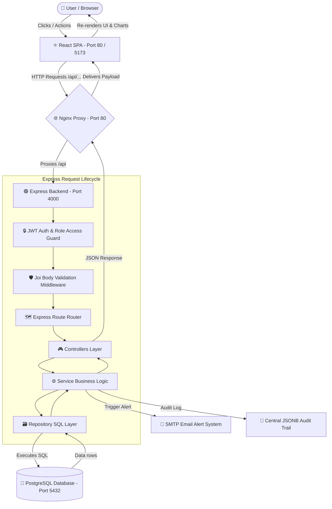
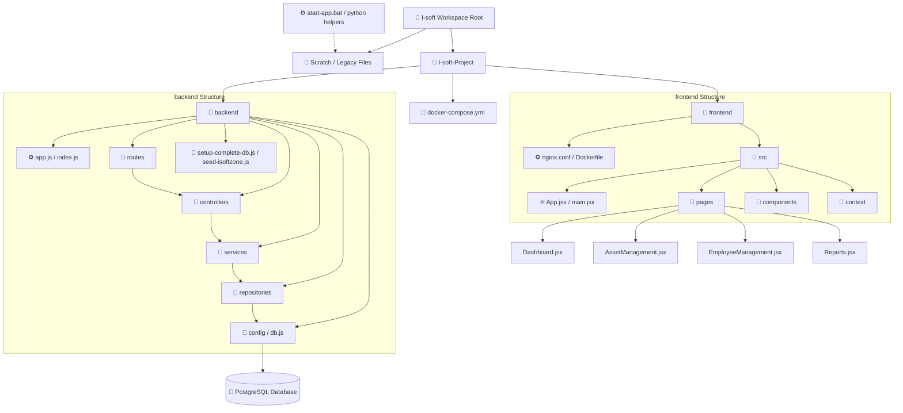

# i-SOFTZONE Enterprise Employee Profile & Operations Portal

A containerized, full-stack enterprise platform built with React (Vite) on the frontend, Node.js (Express) on the backend, and PostgreSQL for the relational database layer.

---

## 🚀 Getting Started (How to Run)

The entire application stack is containerized using Docker. Follow these steps to build, start, and seed the environment.

### 1. Build and Launch Containers
Launch all three services (PostgreSQL, Express API, and Nginx Frontend) in detached mode:
```bash
docker-compose up --build -d
```
The services will be accessible at:
- **Frontend App**: [http://localhost/](http://localhost/) (Port `80`)
- **Backend API**: [http://localhost:4000/](http://localhost:4000/) (Port `4000`)
- **API Docs (Swagger)**: [http://localhost:4000/api-docs/](http://localhost:4000/api-docs/)

### 2. Configure Database Tables
Create table structures and build base database objects:
```bash
docker exec isoftzone_backend npm run seed
```

### 3. Run Audit History Migrations
Ensure the approval history audit tables exist:
```bash
docker exec isoftzone_backend node migrate-approval-history.js
```

### 4. Seed Rich Demo Dataset
Seed all 11 enterprise employees, skills, asset tracker history logs, and multi-day attendance records:
```bash
docker exec isoftzone_backend node seed-isoftzone.js
```

### 5. Build Database Indexes & Views
Build query indexes and data views for reports generation:
```bash
docker exec isoftzone_backend node migrate-indexes-views.js
```

### 🔐 Demo Login Credentials
Use the password `123456` for all:
- **Admin**: `pranay@isoftzone.com` or `rishigarg1290@gmail.com` (use password `admin123`)
- **Manager**: `rahul@isoftzone.com`
- **HR**: `priya@isoftzone.com`
- **Employee**: `amit@isoftzone.com` (React Developer) or `neha@isoftzone.com` (Node Developer)

---

## 🔄 Project Architecture & Request Flow

Below is the request lifecycle and architectural flow of the i-SOFTZONE system:



### Request Flow Stages:
1. **User UI Interaction**: A user triggers an action (e.g., clocks in or requests a leave) in the **React Frontend**.
2. **Reverse Proxy Routing**: Axios dispatches an HTTP request, intercepted by the **Nginx container** on port `80`, which routes `/api` targets to the Express container on port `4000`.
3. **Middleware Guard Checks**: The **Express Backend** passes the request through validation rules (schema verification using Joi) and authorization guards (JWT parsing and role permission level checking).
4. **Controllers & Business Services**: The routing layer forwards the request to **Controllers** which delegate to **Services** to process operations, email reminders, and JSONB audit trails.
5. **SQL Layer & Database**: The **Repository** layer queries **PostgreSQL** to commit transactions or retrieve indexes and views statistics.
6. **Response Pipeline**: Data streams back up to the frontend UI to instantly refresh state, charts, and interactive components.

---

## 📁 Project Directory Structure

```
I-soft/
├── start-app.bat                # Windows local servers batch script launcher
├── README.md                    # Root workspace documentation
└── I-soft-Project/              # Main containerized full-stack application
    ├── docker-compose.yml       # Docker environment configuration
    ├── i-softzone-api-collection.json # Comprehensive Postman API collection
    │
    ├── backend/                 # Express API backend microservice
    │   ├── app.js               # App middleware configs and routes mount
    │   ├── index.js             # Entry listener & background crons initializer
    │   ├── Dockerfile           # Backend container build script
    │   ├── config/              # PostgreSQL db connection & loggers config
    │   ├── routes/              # Express API endpoint routes
    │   ├── controllers/         # API request parameters extraction & handlers
    │   ├── services/            # Core business logic layer (email, audits)
    │   ├── repositories/        # Database query files (SQL separation layer)
    │   ├── middleware/          # Security authentication & global error handlers
    │   ├── utils/               # Schemas and validator helper scripts
    │   ├── seed-isoftzone.js    # Multi-employee enterprise dataset seeder
    │   ├── setup-complete-db.js # Database schema builder
    │   └── migrate-indexes-views.js # Query optimization views & index setups
    │
    └── frontend/                # React Vite client application
        ├── index.html           # Document template mount
        ├── nginx.conf           # Custom Nginx reverse proxy configuration
        ├── Dockerfile           # Multi-stage client build script
        └── src/
            ├── main.jsx         # App bootstrapping entrypoint
            ├── App.jsx          # Route paths & role guards
            ├── index.css        # Harmonious dark/indigo design stylesheet
            ├── components/      # UI components (Buttons, Modals, Cards, Tables)
            ├── context/         # Auth tokens session handlers
            ├── hooks/           # Custom reusable React state wrappers
            ├── services/        # Backend API integration utilities
            └── pages/           # Screen views (Dashboard, Assets, Leaves, Reports)
```

### Visual Directory Flowchart
Here is the structural mapping of directory units and dependency relationships:



---

## 💻 Database Schema Design

```sql
-- 1. Authentication Table
CREATE TABLE users (
    id SERIAL PRIMARY KEY,
    name VARCHAR(100) NOT NULL,
    email VARCHAR(100) UNIQUE NOT NULL,
    password VARCHAR(255) NOT NULL,
    role VARCHAR(20) DEFAULT 'user'
);

-- 2. Department Registry Table
CREATE TABLE departments (
    id SERIAL PRIMARY KEY,
    department_name VARCHAR(100) UNIQUE NOT NULL
);

-- 3. Skills Registry Table
CREATE TABLE skills (
    id SERIAL PRIMARY KEY,
    skill_name VARCHAR(100) UNIQUE NOT NULL
);

-- 4. Employee Profiles Table
CREATE TABLE employees (
    id SERIAL PRIMARY KEY,
    user_id INTEGER NOT NULL REFERENCES users(id) ON DELETE CASCADE,
    department_id INTEGER REFERENCES departments(id) ON DELETE SET NULL,
    phone VARCHAR(20),
    address TEXT,
    designation VARCHAR(100),
    salary NUMERIC(10,2),
    created_at TIMESTAMP DEFAULT NOW()
);

-- 5. Leave Balancing Records
CREATE TABLE leave_balances (
    id SERIAL PRIMARY KEY,
    employee_id INTEGER NOT NULL REFERENCES employees(id) ON DELETE CASCADE UNIQUE,
    sick_leaves INTEGER DEFAULT 12,
    casual_leaves INTEGER DEFAULT 12,
    earned_leaves INTEGER DEFAULT 15
);

-- 6. Leave Applications Table
CREATE TABLE leaves (
    id SERIAL PRIMARY KEY,
    employee_id INTEGER NOT NULL REFERENCES employees(id) ON DELETE CASCADE,
    leave_type VARCHAR(20) NOT NULL,
    start_date DATE NOT NULL,
    end_date DATE NOT NULL,
    reason TEXT NOT NULL,
    status VARCHAR(20) DEFAULT 'pending',
    reviewed_by INTEGER REFERENCES users(id) ON DELETE SET NULL,
    review_notes TEXT,
    created_at TIMESTAMP DEFAULT NOW()
);

-- 7. Approval Audit Trail Table
CREATE TABLE approval_history (
    id SERIAL PRIMARY KEY,
    leave_id INTEGER NOT NULL REFERENCES leaves(id) ON DELETE CASCADE,
    approved_by INTEGER REFERENCES users(id) ON DELETE SET NULL,
    action VARCHAR(20) NOT NULL,
    remarks TEXT,
    created_at TIMESTAMP DEFAULT NOW()
);

-- 8. Daily Attendance Logs Table
CREATE TABLE attendance (
    id SERIAL PRIMARY KEY,
    employee_id INTEGER NOT NULL REFERENCES employees(id) ON DELETE CASCADE,
    check_in_time TIMESTAMP NOT NULL,
    check_out_time TIMESTAMP NULL,
    location VARCHAR(100),
    notes TEXT,
    worked_hours NUMERIC(5,2)
);

-- 9. IT Hardware Inventory Table
CREATE TABLE assets (
    id SERIAL PRIMARY KEY,
    name VARCHAR(100) NOT NULL,
    serial_number VARCHAR(100) UNIQUE NOT NULL,
    status VARCHAR(20) DEFAULT 'available',
    description TEXT,
    created_at TIMESTAMP DEFAULT NOW()
);

-- 10. Hardware Device Allocations Table
CREATE TABLE asset_allocations (
    id SERIAL PRIMARY KEY,
    asset_id INTEGER NOT NULL REFERENCES assets(id) ON DELETE CASCADE,
    employee_id INTEGER NOT NULL REFERENCES employees(id) ON DELETE CASCADE,
    allocated_at TIMESTAMP DEFAULT NOW(),
    returned_at TIMESTAMP NULL,
    notes TEXT
);
```

---

## 📊 Analytics Dashboard Visualizations
The system includes custom Recharts analytics:
1. **Employee Average Clock-In / Clock-Out**: Shows average start/end times per employee with a custom decimal-to-time converter.
2. **Employee Department Distribution**: A donut pie chart displaying division headcount percentages.
3. **Leaves Taken by Employee**: Details total leave days and total applications approved.
4. **Monthly Leave Trend**: An area chart capturing 6-month seasonal trends.
5. **Leave Status Distribution**: Distribution of pending, approved, and rejected records.
6. **Infrastructure Monitoring Gauges**: Real-time Node.js memory footprint, uptime tracking, database status, and API traffic metrics.
